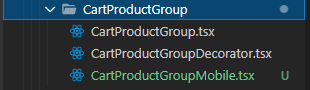
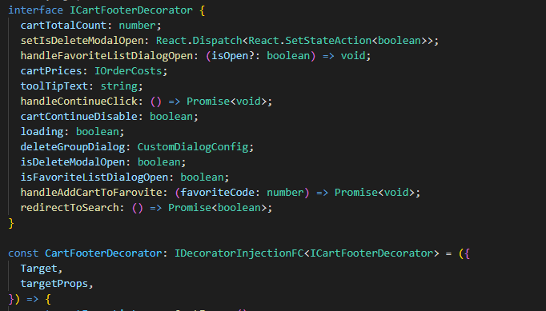
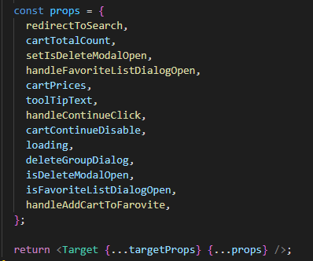
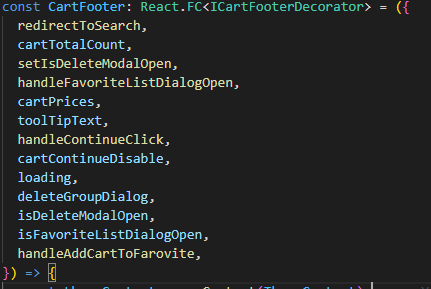
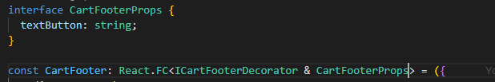
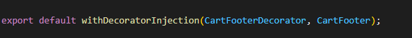

## O que é

Pattern adotado para realizar o desacoplamento de regras para lógica e gerenciamento de estado de componentes React. Realizando esse desacoplamento, é possível `decorar` o componente react que possua somente `view`, com as funções e propriedades respectivas de acordo com sua necessidade e interface de contrato.

## Casos de uso

A aplicação demanda de dois componentes, um cabeçalho para desktop e outro para mobile. Ambos os componentes contam com funções iguais. Dessa forma é construído um componente com as propriedades de `decorator` e 2 componentes, um desktop e outro mobile. Cada componente é decorado com suas funções de logicas respectivas que serão injetadas do componente decorator.

## Pattern de utilização

- Nomenclatura e organização de pastas: Os componentes com propriedades `decorator` levam o prefixo do nome do componente a ser decorado com a palavra `Decorator` de `NomeComponenteDecorator.tsx`. Os componentes de visualização levam o nome respectivo ao seu contexto `NomeComponente.tsx`.
Para a pasta, ela deve ser contemplada com o nome do componente / contexto.

  

- Componente decorator

  - O componente de decoração deve receber a interface `IDecoratorInjectionFC` para inferir os tipos para componente react e suas respectivas props.
    Deve receber uma interface com a estrutura que será injetada no componente a ser decorado (`targetProps`) `IDecoratorInjectionFC<ICartFooterDecorator>`.

    

  - O corpo do componente deve ser composto pelas logicas sendo possível a utilização de tudo que o React permite

  - O componente de decoração deve retornar a `props` `Target` em formato de `JSX.Element` passando um objeto respectivo ao no `targetProps`

    

- Componente de visualização
  - Deve receber a inferência de tipos de um componente react, com a interface de `targetProps`.
    
    - Caso o componente de visualização tenha props exclusivas, deve ser declarada outra interface e realizar o merge entre as duas.
      
  - O componente deve ser exportado utilizando a função responsável por aplicar o decorator. O primeiro argumento deve ser o componente de decoração, seguido do componente que receberá as props.
    
